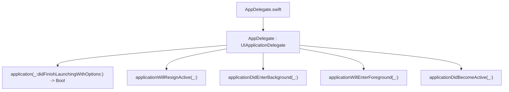

#  Notes

# AppDelegate.swift

```
UIKit app delegate with @main and these lifecycle methods:
    •    application(_:didFinishLaunchingWith… launchOptions:) -> Bool
    •    applicationWillResignActive(_:)
    •    applicationDidEnterBackground(_:)
    •    applicationWillEnterForeground(_:)
    •    applicationDidBecomeActive(_:)
```    

## call map




# GameViewController.swift

Mostly unchanged from xcode template.

## call map

```mermaid
graph TD
  File1["GameViewController.swift"]
  GVC["GameViewController : UIViewController"]
  File1 --> GVC
  GVC --> M1["viewDidLoad()"]
  GVC --> M2["handlePinch(_: UIPinchGestureRecognizer)"]
  GVC --> M3["handlePan(_: UIPanGestureRecognizer)"]
  GVC --> M4["supportedInterfaceOrientations -> UIInterfaceOrientationMask"]
  GVC --> M5["prefersStatusBarHidden -> Bool"]
  ```
  
  # SKTileMapNode_ext.swift
  
  Updates for SKTileMapNode so that it can determine nearest neighbors
  and BFS search.
  
  ## call map

```mermaid
graph TD
  File1["SKTileMapNode_ext.swift"]
  Ext["extension SKTileMapNode"]
  File1 --> Ext
  Ext --> F1["center(_:_: ) -> CGPoint"]
  Ext --> F2["proximityNeighbors(col:row:) -> [(col,row)]"]
  Ext --> F3["inBounds(col:row:) -> Bool"]
  Ext --> F4["isWalkable(col:row:) -> Bool"]
  Ext --> F5["bfsPath(from:to:) -> [(col,row)]?"]
  Ext --> F6["nextStepToward(start:goal:) -> (col,row)?"]
  ```
  
