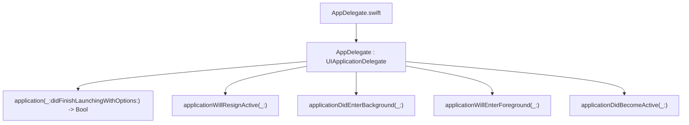

#  Notes

# AppDelegate.swift

```
UIKit app delegate with @main and these lifecycle methods:
    •    application(_:didFinishLaunchingWith… launchOptions:) -> Bool
    •    applicationWillResignActive(_:)
    •    applicationDidEnterBackground(_:)
    •    applicationWillEnterForeground(_:)
    •    applicationDidBecomeActive(_:)
```    

## call map




# GameViewController.swift

Mostly unchanged from xcode template.

## call map

```mermaid
graph TD
  File1["GameViewController.swift"]
  GVC["GameViewController : UIViewController"]
  File1 --> GVC
  GVC --> M1["viewDidLoad()"]
  GVC --> M2["handlePinch(_: UIPinchGestureRecognizer)"]
  GVC --> M3["handlePan(_: UIPanGestureRecognizer)"]
  GVC --> M4["supportedInterfaceOrientations -> UIInterfaceOrientationMask"]
  GVC --> M5["prefersStatusBarHidden -> Bool"]
  ```
  
  # SKTileMapNode_ext.swift
  
  Updates for SKTileMapNode so that it can determine nearest neighbors
  and BFS search.
  
  ## call map

```mermaid
graph TD
  File1["SKTileMapNode_ext.swift"]
  Ext["extension SKTileMapNode"]
  File1 --> Ext
  Ext --> F1["center(_:_: ) -> CGPoint"]
  Ext --> F2["proximityNeighbors(col:row:) -> [(col,row)]"]
  Ext --> F3["inBounds(col:row:) -> Bool"]
  Ext --> F4["isWalkable(col:row:) -> Bool"]
  Ext --> F5["bfsPath(from:to:) -> [(col,row)]?"]
  Ext --> F6["nextStepToward(start:goal:) -> (col,row)?"]
  ```
  
  # GameScene.swift
  
  ## call map

```mermaid
graph TD
  File1["GameScene.swift"]
  GS["GameScene : SKScene"]
  File1 --> GS
  GS --> E1["enum Turn { player, computer }"]

  %% Lifecycle
  GS --> M1["didMove(to:)"]

  %% Unit / helpers
  GS --> M2["addUnit(named:atRow:column:) -> SKNode"]
  GS --> M3["tileIndex(of:) -> (col,row)"]
  GS --> M4["worldPointForTile(col:row:) -> CGPoint"]

  %% Input & highlights
  GS --> M5["touchesEnded(_:with:)"]
  GS --> M6["clearMoveHighlights()"]
  GS --> M7["showMoveHighlights(from:)"]

  %% Turn flow
  GS --> M8["enablePlayerInput(_:)"]
  GS --> M9["endTurn()"]
  GS --> M10["runComputerTurn()"]

  %% Movement
  GS --> M11["moveUnit(_:toCol:row:completion:)"]
  ```
  
## regarding screens and scenes
  
```  
  xcode scene
  -------------------------------------------
  scene:              width, height:    1334, 750
  tile map:           col, rows:        30,   15
  tile size:          width, height:    128,  111 (110.851)
    cols*tile width                     3840
    half size width                     1920
    rows*tile height                    1665
    half size height                    832.5
  
  iphone 16 pro
  ------------------------------------------
  view:               width, height:    874, 402
  scene->view
  on start            width, height:    1392.1, 765.1

  With view such that upper left corner of map is aligned
  to upper left:
  tl corner view      width, height:    -0.8, 0.8
  br corner view      width, height:    1909.5, 1128.9
  
  
  With view such that lower right corner of map is aligned
  to lower right:
  tl corner view      width, height:    -1035.7, -725.8
  br corner view      width, height:    874.6, 402.3

  
  iphone 14
  ------------------------------------------
  view:               width, height:    852, 393
  scene->view
  on start            width, height:    1357.1, 746.4
  
  With view such that upper left corner of map is aligned
  to upper left:
  tl corner view      width, height:    -1.2, -0.6
  br corner view      width, height:    1863.1, 1100.4
  
  
  With view such that lower right corner of map is aligned
  to lower right:
  tl corner view      width, height:    -1009.7, -705.1
  br corner view      width, height:    852.5, 394.7
  
```
